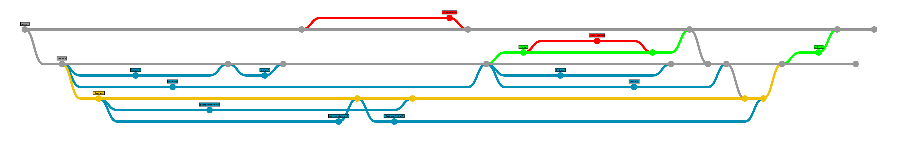

Git Branching
=============

Programmes Branching Model:

**Master**: should be the equivalent of what is on LIVE. When a branch (hotfix or release) is merged in to master, master should be merged in to develop.  
**Develop**: should be the day to day branch we use for branching off of and merging in to.  
**Release**: should be created when we have develop in a state that we want to freeze in order to allow the testers to test without polluting the branch with more features while they are testing. If there are bugs with the release, we can branch off of the release with a hotfix. Release should be merged in to master once testing has been completed. The release branch should then be deleted.    
**FeatureX**: features should be branched off of develop and then PR'd back in to develop.

Long Running Features
=====================
We may come across a case where we want to do a large amount of work which does not need to go LIVE yet. This means the work can't be merged in to develop as that means we would not be able to do any more releases. In this case we can branch off a new branch (playspace in the example image) and treat it like a 2nd develop branch. When the feature is finished, merge to develop. When merging the long-running branch to develop, do a straight git merge, rather than a squash merge as is the default in github.The actual develop branch should be periodically merged into the long-running feature branch. Before merging the long-running feature branch into develop, git rebase -i develop should be done to clean up the commit history. 

Tagging release versions
=====================
When finishing a ticket, after PR'ing into develop from your feature branch, mark the version this is scheduled to be released in in Jira as the "fix version". Where the work is for a feature that will be merged now but not visible to the public for some time (e.g. work on a page type that's not visible to the public yet), do not add a fix version.
